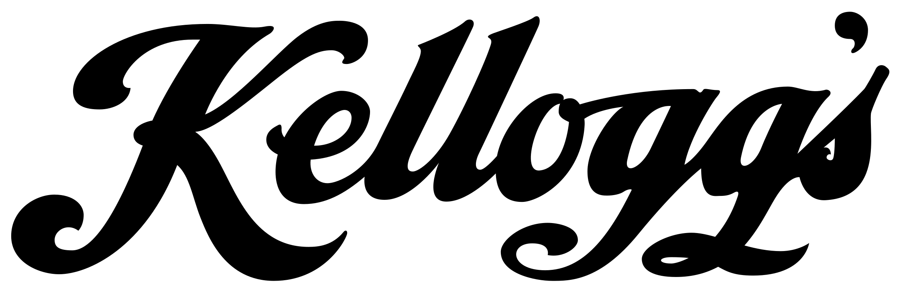
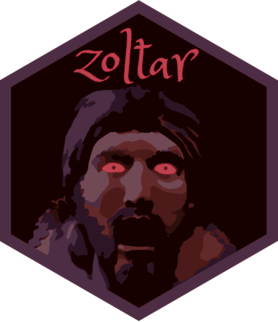

Kassets is a collection of digital materials that may be useful for K
internal development projects.

## Color Palettes

The color_palettes folder contains a list of the official K color
palette presented as either RGB values or hexadecimal codes.

## CSS

The files in the CSS folder are bootstrap CSS files intended for use
with Shiny. As with all other items in this repo, users are encouraged
to create, adapt, and share their contributions here.

## Fonts

The official K fonts are available for use but will not be added to the
repo until it is moved into the K GitHub organizational structure.

## Graphics

It is highly recommended that users share their image resources here and
then leverage this repo and the urls in the repo instead of locally
maintaining and publishing these files alongside your solutions.

The goal is to reduce storage, reduce user effort, and provide a
centralized resource for all users.

Users can either contribute to the repo directly or contact the global
Data Science team to have assets added.

Vector graphics are located in the SVG folder while rasters can be found
in the PNG and thumbs folders.

<!-- Need to add examples of how to use image urls in RMarkdown and Shiny -->
<table>
<tr>
<td>
 <a href="PNG/better_days_plant.png">better_days_plant.png</a>
</td>
<td>
 <a href="PNG/data_science_hex.png">data_science_hex.png</a>
</td>
<td>
 <a href="PNG/gbs.png">gbs.png</a>
</td>
<td>
 <a href="PNG/gdag.png">gdag.png</a>
</td>
<td>
 <a href="PNG/k_hex.png">k_hex.png</a>
</td>
</tr>
<tr>
<td>
 <a href="PNG/k_logo_red.png">k_logo_red.png</a>
</td>
<td>
 <a href="PNG/k_logo_throwback.png">k_logo_throwback.png</a>
</td>
<td>
 <a href="PNG/k_logo_white.png">k_logo_white.png</a>
</td>
<td>
 <a href="PNG/kassets_hex.png">kassets_hex.png</a>
</td>
<td>
 <a href="PNG/klink_hex.png">klink_hex.png</a>
</td>
</tr>
<tr>
<td>
 <a href="PNG/people_analytics.png">people_analytics.png</a>
</td>
<td>
 <a href="PNG/supply_chain_analytics.png">supply_chain_analytics.png</a>
</td>
<td>
 <a href="PNG/zoltar_hex.png">zoltar_hex.png</a>
</td>
</tr>
</table>
